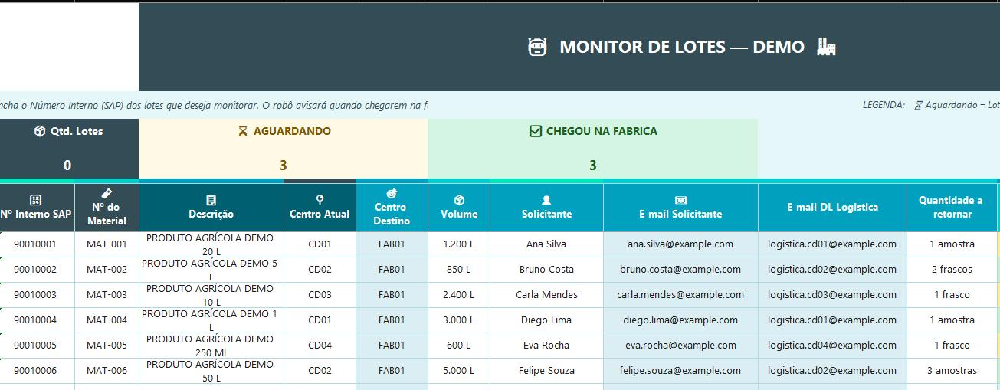
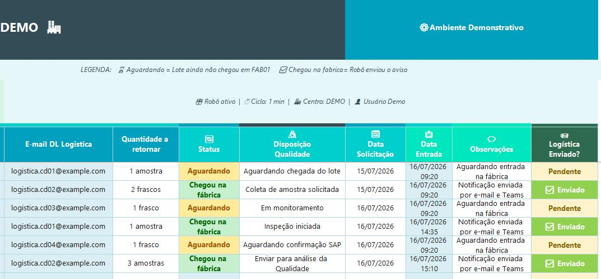
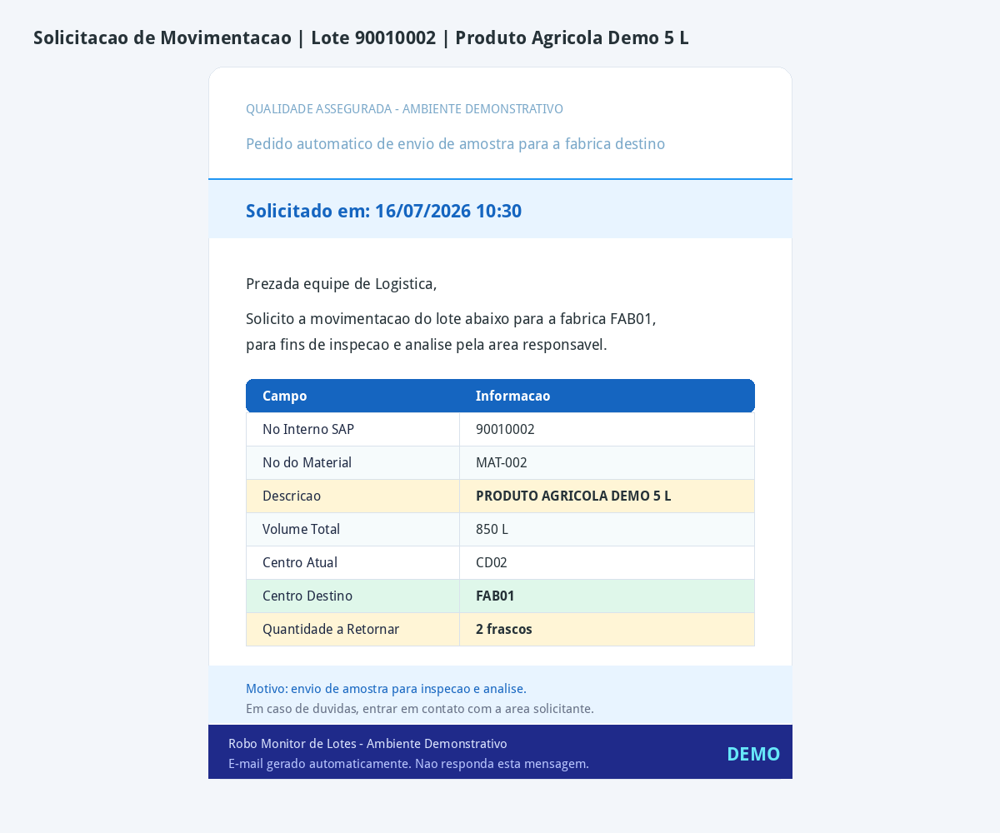
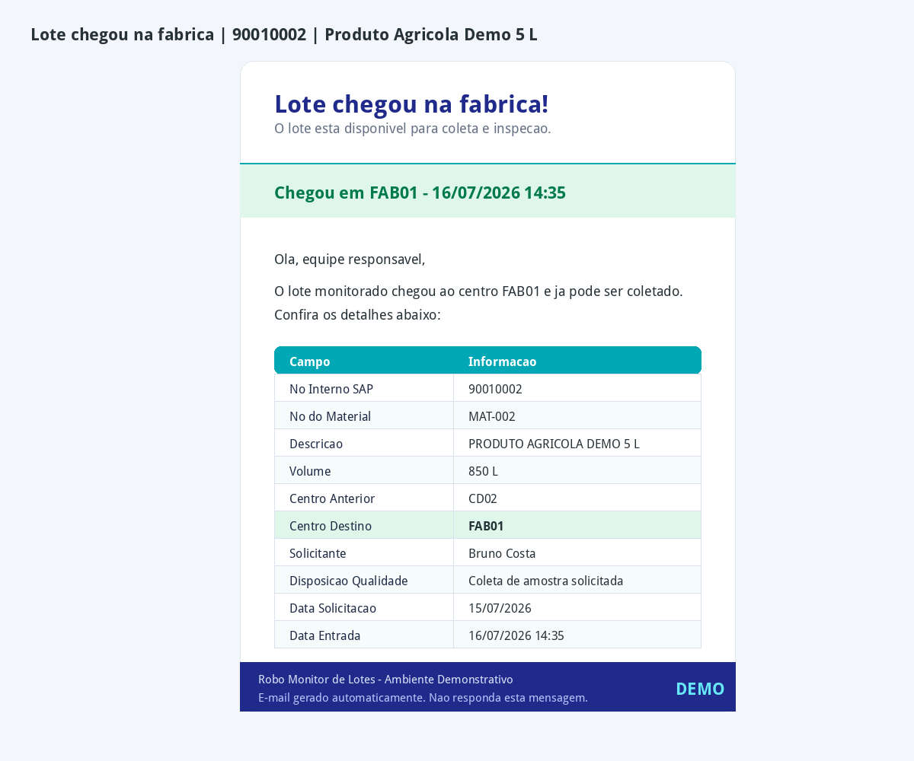

 

### 🤖 Automação inteligente para monitoramento de lotes no SAP

  
  
  
  
  
  

 

> **Transformando consultas manuais no SAP em um processo automatizado, rastreável e orientado à ação.**

---

## 🧭 Visão Geral

Este projeto automatiza o monitoramento de lotes no SAP, eliminando a necessidade de verificações manuais recorrentes e acelerando a comunicação entre Especialistas e Produção.

A solução lê os lotes em uma base Excel, consulta o status diretamente no SAP e, ao identificar a chegada do lote à fábrica, atualiza a planilha de controle e envia alertas automáticos por Outlook e Microsoft Teams.

---

## 🧩 Contexto do Problema

Em um ambiente produtivo com alto volume de lotes, o acompanhamento dependia de consultas manuais no SAP ao longo do dia. O especialista precisava verificar se o lote havia chegado à fábrica e, somente depois, acionar a Produção para iniciar as etapas de inspeção.

Quando essa identificação ocorria horas depois da chegada real do lote, havia risco de atraso no início da coleta de amostra, inspeção, análise da Qualidade e tratativa de possíveis desvios.

---

## 💡 Solução Implementada

<table>
  <tr>
    <td width="33%">
      <h3>📥 Entrada de Dados</h3>
      
Leitura automática dos lotes informados em uma base Excel.

    </td>
    <td width="33%">
      <h3>🤖 Automação RPA</h3>
      
Execução automatizada das consultas no SAP para validação do status dos lotes.

    </td>
    <td width="33%">
      <h3>📢 Comunicação</h3>
      
Envio de notificações simultâneas por Outlook e Microsoft Teams para as áreas responsáveis.

    </td>
  </tr>
</table>

A automação foi desenvolvida em Python com abordagem RPA para conectar Excel, SAP, Outlook e Microsoft Teams em um fluxo automatizado de ponta a ponta.

O robô lê os lotes na planilha, consulta cada item no SAP, identifica a chegada à fábrica, atualiza a base de controle e dispara alertas automáticos para Especialistas e Produção.

---

## 📈 Impacto Operacional

<table>
  <tr>
    <td width="50%">
      <h3>⏱️ Tempo de Resposta</h3>
      
Redução do intervalo entre a chegada do lote à fábrica e o acionamento das áreas responsáveis.

    </td>
    <td width="50%">
      <h3>🔔 Comunicação Simultânea</h3>
      
Especialistas e Produção passaram a receber notificações ao mesmo tempo por e-mail e Microsoft Teams.

    </td>
  </tr>
  <tr>
    <td width="50%">
      <h3>🔍 Visibilidade Operacional</h3>
      
Maior controle sobre lotes aguardando inspeção, análise ou tratativa.

    </td>
    <td width="50%">
      <h3>🚀 Liberação para Venda</h3>
      
Apoio ao fluxo de inspeção, análise da Qualidade, causa raiz e liberação dos produtos para venda.

    </td>
  </tr>
</table>

---

## 🚀 Funcionalidades

<table>
  <tr>
    <td width="50%">📄 <b>Leitura automática de planilha Excel</b></td>
    <td width="50%">🤖 <b>Execução automatizada do processo via RPA</b></td>
  </tr>
  <tr>
    <td width="50%">🖥️ <b>Consulta automática de lotes no SAP</b></td>
    <td width="50%">✅ <b>Identificação do status de chegada do lote</b></td>
  </tr>
  <tr>
    <td width="50%">📊 <b>Atualização automática da base de controle</b></td>
    <td width="50%">📧 <b>Envio de notificações automáticas por e-mail</b></td>
  </tr>
  <tr>
    <td width="50%">💬 <b>Envio de alertas automáticos pelo Microsoft Teams</b></td>
    <td width="50%">🔄 <b>Monitoramento recorrente dos lotes</b></td>
  </tr>
</table>

---
## 🛠️ Stack Técnica

### Linguagem, ambiente e sistemas

  
  
  

### Entrada, controle e comunicação

  
  
  

### Conceitos aplicados

  
  
  
  

---

## 📚 Bibliotecas Python

### Dados e planilhas

  
  

### Automação de interface

  
  
  

### Integrações e notificações

  
  

## 🖼️ Demonstração

> As imagens abaixo utilizam dados fictícios, sem exposição de informações reais, credenciais, lotes, e-mails ou dados corporativos.

### 📄 Base de dados com preenchimento automático

A planilha foi estruturada para apoiar o monitoramento dos lotes e reduzir preenchimentos manuais. Por meio de fórmulas, informações como e-mail do solicitante e DL/e-mail responsável pela logística são preenchidas automaticamente conforme os dados informados.

#### Visão da base de entrada

#### Controle de status e notificações

### 📧 E-mail automático de solicitação ao CD/Logística

Com base nas informações fornecidas no Excel, o robô envia automaticamente uma solicitação ao CD/logística responsável, solicitando o envio da amostra ou item necessário para o destino da fábrica.

---

### ✅ E-mail automático de chegada do lote

Após a solicitação, o robô monitora o SAP e, quando identifica que o lote chegou à fábrica, atualiza a base de controle e envia notificações automáticas para Especialistas e Produção.

---

## 🔐 Confidencialidade

Este repositório contém uma versão demonstrativa/documentada do projeto, sem dados sensíveis, credenciais, registros reais ou informações corporativas internas.

---

### ✨ De uma rotina manual para um processo automatizado, rastreável e orientado à ação.

